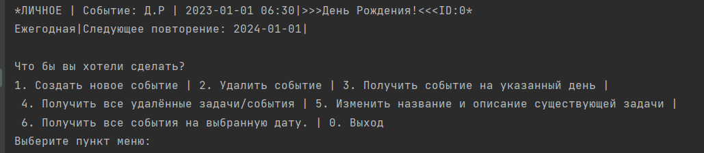

# Ежедневник "DairyService" на Java

---
### Разработчик
- [Кирилл Вохминов](https://github.com/KaerLaende)

---
## Описание проекта
Программа создания, отслеживания и работы с задачами/событиями.
Работа с данной программой происходит через консоль, в которую после запуска приложения будет выведено меню.
Из которого путем отправки в консоль сообщения необходимо написать текстовое сообщение с пунктом меню или описать событие.

